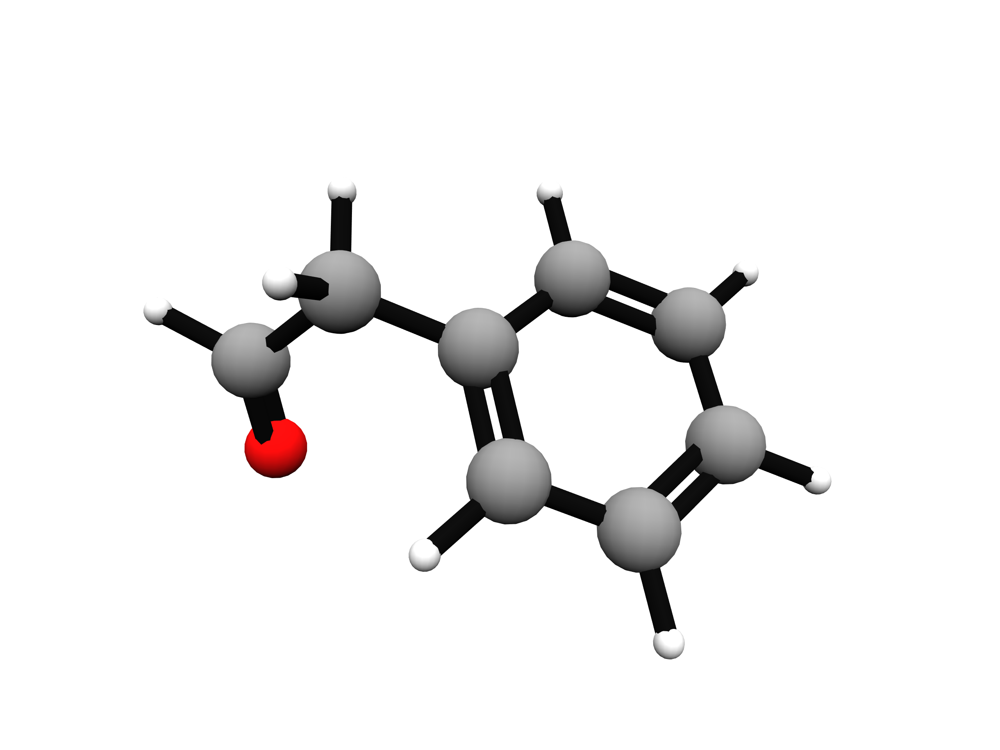

AQML: Amons-based Quantum Machine Learning for quantum chemistry
=======
[](https://doi.org/10.5281/zenodo.3670027)


AQML is a mixed Python/Fortran/C++ package, intends to simulate quantum chemistry problems through the use of **amons** --- the fundamental building blocks of larger systems (such as protein, solid).


*Authors:* 
- Bing Huang (University of Basel, Switzerland) bing.huang@unibas.ch
- Anatole von Lilienfeld (University of Basel, Switzerland) anatole.vonlilienfeld@unibas.ch


*Created:* 2019


# Features:

- Amons selection algorithm: automatic sampling of training set that are most representative for the query
  - composition and size-independent
  - currently limited to molecule/solid with explicit graph (w/wo periodic boundary condition)

- Molecular representation
  - Parameter-free global SLATM (Spectrum of London and Axilrod-Teller-Muto potential) representations
    - global SLATM and its local (atomic) counterpart aSLATM. 
    - A new pair-wise version of aSLATM is available, dealing favorably with dataset involving many elements.
  - Bond, Angle ML (BAML) representation, including up to 4-body potential (UFF inspired)
  - Graph-based representation (coming soon...)

- Machine learning
  - KRR and multi-fidelity KRR
  - Deep neural network potential (under developement...)

- Automatic workflow of generating quantum chemical reference data. The following programs are currently supported:
  - G09
  - ORCA4
  - MOLPRO
  - CASINO (a QMC package)


# Todo's
- Remove the dependency on `ase` and `oechem`
- Force prediction using SLATM
   - geometry optimization
   - molecular dynamics


# Installation

The code was tested only under Linux/Mac OS.

## Requirements

`aqml` is a python/fortran package that requires a number of dependencies:

- `numpy` & `scipy`
- `rdkit` or `oechem`: cheminformatic package (`oechem` needs for an academic license, which is free though)
- `networkx` a Python package for the creation, manipulation, and study of the structure, dynamics, and functions of complex networks. [https://networkx.github.io/documentation/stable/install.html]
- `ase`: Atomic Simulation Environment [https://wiki.fysik.dtu.dk/ase/install.html]


optional:
- `h5py`: for reading/writing hdf5 file
- `dftd3`: A dispersion correction for density functionals and other methods [https://www.chemie.uni-bonn.de/pctc/mulliken-center/software/dft-d3/get-the-current-version-of-dft-d3]
- `imolecule`: draw mol interactively in jupyter-notebook (recommended)
- `indigo`: cheminformatic package https://lifescience.opensource.epam.com/indigo/index.html#download-and-install
- `openbabel`: cheminformatic package http://openbabel.org/wiki/Category:Installation (install through `conda install -y -c openbabel openbabel`)


I recommend using `conda` (for Python 3.7+) to install all dependencies


## Build & Install 

Steps

- miniconda or anaconda (go to https://docs.conda.io/projects/conda/en/latest/user-guide/install/ and follow the instructions there. Note that Python >=3.6 is preferred!)


- clone the repository

```bash
git clone https://github.com/binghuang2018/aqml.git
```

- build & install `aqml`
```bash
cd aqml
export AQML_ROOT=$PWD
export CHEMPACK=OECHEM
./install.sh
```

when oechem is used , one has to also install the license file through
```bash
echo "export OE_LICENSE=/path/to/oe_license.txt" >>~/.bashrc; source ~/.bashrc
```

Alternatively, one can use `RDKit` by setting `export CHEMPACK=RDKIT`, however, relevant code is still buggy (for vdW systems only) and under development.

Now you are ready to go!


# Usage

Here, we offer the basics for amons generation. Refer to Jupyter notebooks under folder `doc/` for more usages.
Two options are available:

## Command line

Example:

1) Generating amon graphs only if input is molecular graph.

```bash
  $ genamon -k 6 "Cc1ccccc1"
```
produces 7 unique canonical SMILES (oechem standard)

```bash
cans= ['C', 'C=C', 'C=CC=C', 'CC=C', 'CC(=C)C=C', 'CC=CC=C', 'c1ccccc1']
```

2) Generating amons with 3D coordinates if the input contains 3D coords (option `-i3d` could be skipped if input file is of the following formats: `sdf`, `mol` or `pdb`. Abitrary number of input files is supported).
```bash
  $ genamon -k 6 -i3d test/phenol.sdf
```
gives the following output
```bash
...
 ++ found 16 cov amons
 cans= ['O', 'C=C', 'C=CC=C', 'c1ccccc1', 'C=CO', 'C=CC(=C)O', 'C=CC=CO']
 size of maps:  (10, 3)
-- time elaped:  0.33088088035583496  seconds
```
and a file `g6.out` summarizing the generated amons
```bash
       #NI      #im       #nc       #ic                                                      #SMILES
        1   000001         1         1                                                            O
        2   000002         1         2                                                          C=C
        3   000003         2         4                                                         C=CO
        4   000004         1         5                                                       C=CC=C
        5   000005         2         7                                                    C=CC(=C)O
        5   000006         2         9                                                      C=CC=CO
        6   000007         1        10                                                     c1ccccc1
```
where `NI` indicates the number of heavy atoms, `im` is the index of unique amon (amon graph), `nc` is the number of conformers associated with each amon graph, `ic` is the cumulative index of amon conformers, `SMILES` is of oechem standard.

Meanwhile, a folder `g6/` is also generated, containing the following files:
```bash
frag_1_c00001.sdf  frag_3_c00002.sdf  frag_5_c00002.sdf  frag_7_c00001.sdf
frag_2_c00001.sdf  frag_4_c00001.sdf  frag_6_c00001.sdf  i-raw/
frag_3_c00001.sdf  frag_5_c00001.sdf  frag_6_c00002.sdf  map.pkl
```
As one can see from above, there are three kinds of files: i) sdf files storing 3d geometry of amon conformer has the format `frag_[digit(s)]_c[digits].sdf`, where the first entry of digits is the numbering of mol graphs, while the second entry corresponds to the numbering of associated conformers for each mol graph. ii) a mapping file `map.pkl`, containing the idx of amons (of the same order as above for amons in file `g6.txt`) for all query molecules. If there is only one query mol,
this file is not useful at all. iii) the folder `i-raw/` stores the original local geometry of fragments of the query mol(s). There exists a 1-to-1 mapping from each sdf file in `g7/` and `g7/i-raw`. E.g., for the file `frag_6_c00002.sdf` under `g7/`, the corresponding file in `g7/i-raw/` is `frag_6_c00002_raw.sdf`. The only difference is that newly added hydrogen atoms in `frag_6_c00002.sdf` are optimized by MMFF94, while the H's in `frag_6_c00002_raw.sdf` are not.

To speed up generation of amons when a large amount of files are given as input, an option `-mpi` can be specified together with `-nprocs [NPROCS]`. Essentially, the python module `multithreading` was used.


## Python shell

### Amon graphs generataion

If your input is mol graph, the output is also mol graph, though of smaller size.

```bash

>>> import aqml.cheminfo.oechem.amon as coa
>>> li = ['Cc1ccccc1']
>>> obj = coa.ParentMols(li, k=5, i3d=False)
>>> a = obj.generate_amons()
>>> a.cans
['C', 'C=C', 'C=CC=C', 'CC=C', 'CC(=C)C=C', 'CC=CC=C', 'c1ccccc1']

```

### Amons conformer generataion

If your input is mol graph together with 3d coordinates (such as a sdf file), the output is amons with 3d coords (hereafter we call them amons conformers).

```bash
>>> import aqml.cheminfo.oechem.amon as coa

>>> li = ['test/phenol.sdf', ] # multiple 
>>> obj = coa.ParentMols(li, k=5, i3d=True)
>>> a = obj.generate_amons()
>>> a.cans
['C', 'C=C', 'C=CC=C', 'CC=C', 'CC(=C)C=C', 'CC=CC=C', 'c1ccccc1']
```
Meanwhile, the same files (`g5.out` and directory `g5/`) would be generated as in the case of running `genamon` from the commandline above.


# Demo

A Demo (see demo/README.md for detail) is provided for an exemplified QM9 molecule (molecule I in Fig. 2C of reference [huang2017dna], also shown below),



covering the four essential aspects of AML:

- Generation of amons
- Quantum chemistry calculations for target molecule and its associated amons
- Generation of aSLATM representation 
- AML prediction of the total energy of the target molecule.


# Publications

If you have used `aqml` in your research, please consider citing these papers:

1. "Understanding molecular representations in machine learning: The role of uniqueness and target similarity", B. Huang, OAvL,J. Chem. Phys. (Communication) 145 161102 (2016), https://arxiv.org/abs/1608.06194
2. "Boosting quantum machine learning models with multi-level combination technique: Pople diagrams revisited" P. Zaspel, B. Huang, H. Harbrecht, OAvL submitted to JCTC (2018) https://arxiv.org/abs/1808.02799
3. "The DNA of chemistry: Scalable quantum machine learning with amons", B. Huang, OAvL, arXiv:1707.04146, 2017, https://arxiv.org/abs/1707.04146

```bash
@article{BAML,
   author = "Huang, Bing and von Lilienfeld, O. Anatole",
   title = "Communication: Understanding molecular representations in machine learning: The role of uniqueness and target 
similarity",
   journal = "Journal of Chemical Physics",
   year = "2016",
   volume = "145",
   number = "16",
   eid = 161102,
   pages = "",
   doi = "http://dx.doi.org/10.1063/1.4964627"
}
@article{zaspel2018boosting,
  title={Boosting quantum machine learning models with a multilevel combination technique: pople diagrams revisited},
  author={Zaspel, Peter and Huang, Bing and Harbrecht, Helmut and von Lilienfeld, O Anatole},
  journal={Journal of chemical theory and computation},
  volume={15},
  number={3},
  pages={1546--1559},
  year={2018},
  publisher={ACS Publications},
  doi = {https://doi.org/10.1021/acs.jctc.8b00832}
}
@article{huang2017dna,
  title={The ``DNA'' of chemistry: Scalable quantum machine learning with ``amons''},
  author={Huang, Bing and von Lilienfeld, O Anatole},
  journal={arXiv preprint arXiv:1707.04146},
  url={https://arxiv.org/abs/1707.04146},
  year={2017}
}

```

