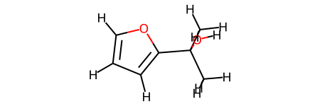
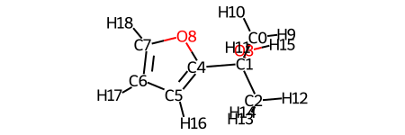
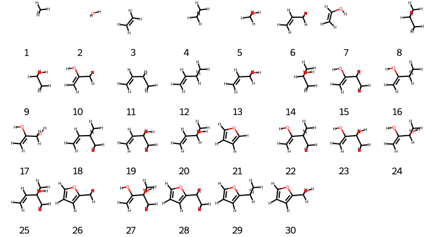

Amons generation and visualization
==================================

In this section, the basic usage of the code is illustrated for an exmplified QM9 molecule.

Topics:
- covalent amons generation 
  - for one query
  - for multiple queries
- visualization of amons


```python
from rdkit import Chem
from aqml import io2
import aqml.cheminfo.rdkit.rdkit as crr
import aqml.cheminfo.draw.core as cdc

fs = io2.cmdout('ls ../../tests/cov/*sdf')
#fs
```

    WARNING:root:Open Babel >3.0 not found. Format conversion disabled.


Convert SDF file to RDKit molecule


```python
m = crr.sdf2oem(fs[-1])
```

By simply typing `m`, one sees its 2d structure


```python
m
```


    

    


For more robust visualization, use an enhanced module `cheminfo.draw.core`


```python
vr = cdc.draw_rdkit()
vr.viewm(fs[-1], woH=False) # set woH to True if one wants not to show H atoms
```


    

    


One could see more usages by typing `help(vr)`


```python

```

### Covalent amons generation for a single query molecule

Note that the python codes below is only for the purpose of diagnosis. It's recommended to use `AQML_ROOT/bin/genamon` for routine generation of amons.


```python
import aqml.cheminfo.algo.amon as caa

# `wg`: write geometry of amons to files? True/False
fs1 = [fs[-1] ]
obj = caa.ParentMols(fs1, k=7, verbose=0, wg=False, i3d=True)
print('number of molecular graphs: ', len(obj.cans))
print('number of conformers: ', len(obj.ms))
```

    number of molecular graphs:  25
    number of conformers:  30


Above, `k=7` stands for the maximal number of heavy atoms allowed for an amon is 7, `verbose=0` indicates zero cov regarding details about amons generation. `wg=False` means that no 3D geometry is gonna be written to some file. `i3d=True` suggests that 3D geometry of query molecule are taken into account.

As one can see, more conformers (totalling 30 were generated). This is due to the fact that there might be more than 1 conformer for a given molecular graph (in particular for those molecules containing flexible/rotatable bonds). 


```python
smiles = obj.cans
smiles
```


    ['C',
     'O',
     'C=C',
     'CC',
     'CO',
     'C=CC',
     'C=CO',
     'CCC',
     'CCO',
     'C=C(C)O',
     'C=CCC',
     'C=CCO',
     'CC(C)O',
     'C=C(O)CC',
     'C=C(O)CO',
     'C=CC(C)C',
     'C=CC(C)O',
     'c1ccoc1',
     'C=C(O)C(C)C',
     'C=C(O)C(C)O',
     'C=CC(C)(C)O',
     'Cc1ccco1',
     'C=C(O)C(C)(C)O',
     'CCc1ccco1',
     'OCc1ccco1']


Note that if `i3d` was set to `False` (set `iwa=False` meanwhile, i.e., do not write SMILES to a file; if one uses default option of `iwa`, which is `True`, then one needs so specify the filename through `label=<string>`), then the same set of `smiles` would be generated, but with no conformers.


```python
obj_c0 = caa.ParentMols(fs1, k=7, verbose=0, wg=False, i3d=False, iwa=False)
print('number of molecular graphs: ', len(obj_c0.cans))
print('number of conformers: ', len(obj_c0.ms))
```

    number of molecular graphs:  31
    number of conformers:  0


```python

```


```python

```

### Covalent amons generation for multiple query molecules

Note that the python codes below is only for the purpose of diagnosis. It's recommended to use `AQML_ROOT/bin/genamon` for routine generation of amons.

Procedure for this is basically the same as for the case of single query, with one minor exception that a new map file is generated meanwhile. See below for details.

Here, we generate amons of all 3 test molecules.


```python
# `wg`: write geometry of amons to files? True/False
obj3 = caa.ParentMols(fs, verbose=0, wg=False) 
print('number of molecular graphs: ', len(obj3.cans))
print('number of conformers: ', len(obj3.ms))
```

    number of molecular graphs:  42
    number of conformers:  66


Now to get an idea of which sets of amons belong to which query, we have to have a look at the attribute `maps`:


```python
obj3.maps
```


    array([[ 0,  2,  4,  9,  7, 38, 13, 36, 57, 14, 29, 53, 39, 15, 37, 61,
            58, 50, 16, 30, 54, -1, -1, -1, -1, -1, -1, -1, -1, -1],
           [ 0,  2,  3,  4,  9,  7, 40, 18, 42, 63, 23, 31, 55, 41, 15, 19,
            43, 62, 64, 51, 24, 17, 32, 56, -1, -1, -1, -1, -1, -1],
           [ 0,  1,  5,  6,  2,  8, 44,  7, 12, 49, 22, 28, 65, 11, 34, 46,
            20, 26, 59, 10, 25, 48, 52, 35, 47, 33, 45, 21, 27, 60]])


The shape of `maps` is `(3, 30)`, where `3` corresponds to the number of queries, while `30` indicates the maximal number of amons to which a query could be decomposed. In this very case, molecular `3` (`03.sdf`) turns out to be such a query that is made up of the most diverse atomic environments. For query with less than `30` amons, relevant entries with no amon correspondence are padded by `-1`. Note that all non-negative entries correspond to the conformer index (when `i3d=True`) and begin with 0, i.e., the first conformer in `obj3.ms`.


```python

```

### Visualization 

To visualize the pseudo-3D geometries of these amon conformers, use `vr.viewms`

Here are some essential parameters of this function:
- nmr: number of molecules per row to be displayed
- wlgd_text: description text for each conformer, could be one of 'id', 'smiles'
- molSize: the size of the image for each molecule
```


```python
vr.viewms(obj.ms, wlgd_text='id', nmr=8, molSize=(90,100))
```


    

    


