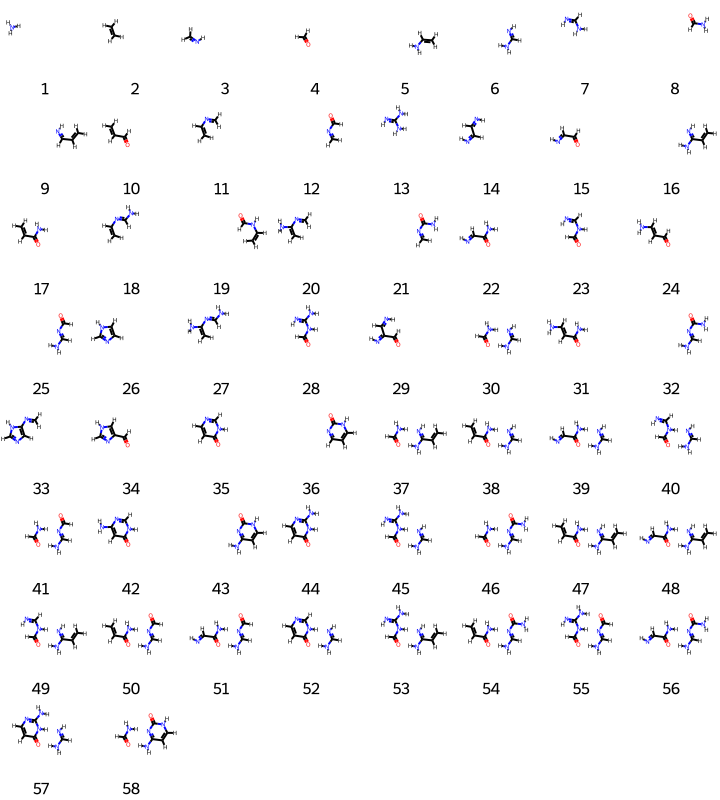

# vdW amons generation


```python
from rdkit import Chem
from aqml import io2
import aqml.cheminfo.rdkit.rdkit as crr
import aqml.cheminfo.draw.core as cdc
import aqml.cheminfo.rdkit.core  as crc

import aqml.cheminfo.molecule.elements as el #import Elements
#from importlib import reload
#reload(crc); reload(el)

# search for all files under directory vdw/
fs = io2.cmdout('ls ../../tests/vdw/*sdf')
fs
```

    WARNING:root:Open Babel >3.0 not found. Format conversion disabled.


    ['../../tests/vdw/AT.sdf', '../../tests/vdw/GC.sdf']


```python
vr = cdc.draw_rdkit()
vr.viewm(fs[-1], woH=False) 
```


    

    


```python
import aqml.cheminfo.rdkit.rdkit as crr

m = crr.StringM(fs[-1])

```

Here are a list of non-covalent bonds:


```python
m.ncbs 
```


    [[5, 25], [13, 22], [14, 20], [20, 25]]


```python

```


```python
import aqml.cheminfo.algo.amon as caa

# `wg`: write geometry of amons to files? True/False
fs1 = [fs[-1] ]
obj = caa.ParentMols(fs1, k=8, k2=11, ivdw=True, verbose=1, wg=False, i3d=True)
print('number of molecular graphs: ', len(obj.cans))
print('number of conformers: ', len(obj.ms))
```

    #Mid 1 ../../tests/vdw/GC.sdf
    r56= [0 1 3 4 6 7]
    r56= [0 1 3 4 6 7]
    r56= [1 2 4 5 6 7]
      ++ found 55 cov amons
    | Now perceive vdw connectivity between standalone amons
       found more than 2 HB's in a conj env N=CN.NC=O keep it!
       found more than 2 HB's in a conj env N=CN.N=CNC=O keep it!
       found more than 2 HB's in a conj env N=C(N)NC=O.N=CN keep it!
       found more than 2 HB's in a conj env C=CC(N)=O.N=CN keep it!
       found more than 2 HB's in a conj env N=CN.O=c1ccnc[nH]1 keep it!
       found more than 2 HB's in a conj env N=CN.Nc1nccc(=O)[nH]1 keep it!
       found more than 2 HB's in a conj env N=CC(N)=O.N=CN keep it!
       found more than 2 HB's in a conj env N=CN.Nc1cc(=O)[nH]cn1 keep it!
       found more than 2 HB's in a conj env N=CN.NC=CC(N)=O keep it!
       found more than 2 HB's in a conj env C=CC(=N)N.NC=O keep it!
       found more than 2 HB's in a conj env C=CC(=N)N.N=CNC=O keep it!
       found more than 2 HB's in a conj env C=CC(=N)N.N=C(N)NC=O keep it!
       found more than 2 HB's in a conj env C=CC(=N)N.C=CC(N)=O keep it!
       found more than 2 HB's in a conj env C=CC(=N)N.N=CC(N)=O keep it!
       found more than 2 HB's in a conj env C=CC(=N)N.NC=CC(N)=O keep it!
       found more than 2 HB's in a conj env C=NC=O.N=C(N)N keep it!
       found more than 2 HB's in a conj env N=C(N)N.NC=NC=O keep it!
       found more than 2 HB's in a conj env NC=NC=O.NC=O keep it!
       found more than 2 HB's in a conj env N=C(N)NC=O.NC=NC=O keep it!
       found more than 2 HB's in a conj env C=CC(N)=O.NC=NC=O keep it!
       found more than 2 HB's in a conj env N=CC(N)=O.NC=NC=O keep it!
       found more than 2 HB's in a conj env NC=CC(N)=O.NC=NC=O keep it!
       found more than 2 HB's in a conj env N=C(N)N.O=c1nccc[nH]1 keep it!
       found more than 2 HB's in a conj env NC=O.Nc1cc[nH]c(=O)n1 keep it!
       found more than 2 HB's in a conj env C=NC(N)=O.N=C(N)N keep it!
       found more than 2 HB's in a conj env N=C(N)N.NC=NC(N)=O keep it!
       found more than 2 HB's in a conj env NC=NC(N)=O.NC=O keep it!
       found more than 2 HB's in a conj env C=CC(N)=O.NC=NC(N)=O keep it!
       found more than 2 HB's in a conj env N=CC(N)=O.NC=NC(N)=O keep it!
    amon connectivity done
      ++ found 29 vdw amons with ncomb=2
         now search for vdw amon made up of 3 cov amons
         done within time:  0.005838155746459961  seconds
      ++ found 0 vdw amons with ncomb=3
    atom indices of all amons done
    
    
        post-screening: found vdw amons N=CN.Nc1cc(=O)[nH]cn1 with changed hyb, skip!
        post-screening: found vdw amons N=CN.NC=CC(N)=O with changed hyb, skip!
        post-screening: found vdw amons C=CC(=N)N.NC=CC(N)=O with changed hyb, skip!
        post-screening: found vdw amons C=NC=O.N=C(N)N with changed hyb, skip!
        post-screening: found vdw amons N=C(N)N.NC=NC=O with changed hyb, skip!
        post-screening: found vdw amons NC=CC(N)=O.NC=NC=O with changed hyb, skip!
        post-screening: found vdw amons N=C(N)N.O=c1nccc[nH]1 with changed hyb, skip!
        post-screening: found vdw amons C=NC(N)=O.N=C(N)N with changed hyb, skip!
        post-screening: found vdw amons N=C(N)N.NC=NC(N)=O with changed hyb, skip!
       ## found 20 mol complexes!
    amons now ready for filtering
    cans= ['N', 'C=N', 'C=C', 'C=O', 'C=CN', 'N=CN', 'C=CC(=N)N', 'C=CC=N', 'C=NC=O', 'NC=NC=O', 'NC=O', 'O=c1nccc[nH]1', 'Nc1cc[nH]c(=O)n1', 'C=NC(N)=O', 'NC=NC(N)=O', 'C=CNC=O', 'N=C(N)N', 'N=CNC=O', 'N=C(N)NC=O', 'C=CN=C', 'C=CN=CN', 'C=CC=O', 'C=CC(N)=O', 'O=c1ccnc[nH]1', 'Nc1nccc(=O)[nH]1', 'N=CC(=N)C=O', 'N=CC=N', 'N=CC=O', 'N=CC(N)=O', 'C=NC(=C)N', 'Nc1cc(=O)[nH]cn1', 'C=C(N)N=CN', 'NC=CC=O', 'NC=CC(N)=O', 'c1c[nH]cn1', 'C=Nc1cnc[nH]1', 'O=Cc1c[nH]cn1', 'N=CN.NC=O', 'N=CN.N=CNC=O', 'N=C(N)NC=O.N=CN', 'C=CC(N)=O.N=CN', 'N=CN.O=c1ccnc[nH]1', 'N=CN.Nc1nccc(=O)[nH]1', 'N=CC(N)=O.N=CN', 'C=CC(=N)N.NC=O', 'C=CC(=N)N.N=CNC=O', 'C=CC(=N)N.N=C(N)NC=O', 'C=CC(=N)N.C=CC(N)=O', 'C=CC(=N)N.N=CC(N)=O', 'NC=NC=O.NC=O', 'N=C(N)NC=O.NC=NC=O', 'C=CC(N)=O.NC=NC=O', 'N=CC(N)=O.NC=NC=O', 'NC=O.Nc1cc[nH]c(=O)n1', 'NC=NC(N)=O.NC=O', 'C=CC(N)=O.NC=NC(N)=O', 'N=CC(N)=O.NC=NC(N)=O']
     ## summary: found 57 molecular graphs, 58 configurations
    number of molecular graphs:  57
    number of conformers:  58


```python
vr.viewms(obj.ms, wlgd_text='id', nmr=8, molSize=(90,100))
```


    

    


